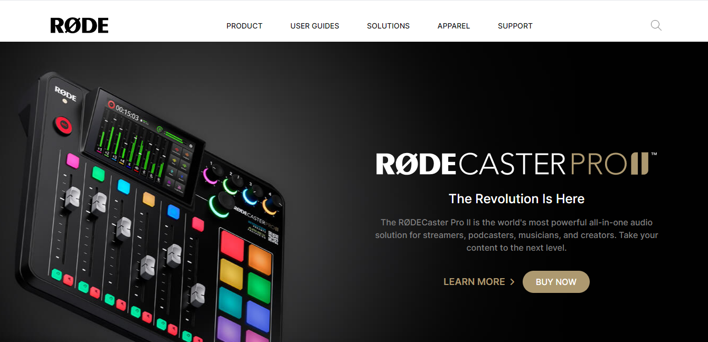

# RODE Clone

##  Created by : [Gaurav Kumar](https://the-gaurav-portfolio.netlify.app/)

 

***

### Tech I Used
 

***

## My Key Learnings from this project

 

### In this project, I build a RODE Clone Using Tailwind CSS

- In this project, I learned how to use background-image using Tailwind CSS.

- I learned, how to hide or see images/icons based on the screen size.

- I learned, how to build hero images with Tailwind CSS.

- I learned, about hover effect on buttons.

***

### Checkout the webiste : [Click Here](https://the-shopify.netlify.app/)

***
 

### How the RODE Clone is looking

 

### Website View

 

### Mobile View

 
